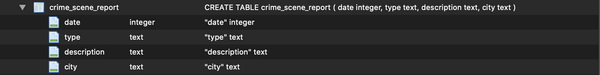
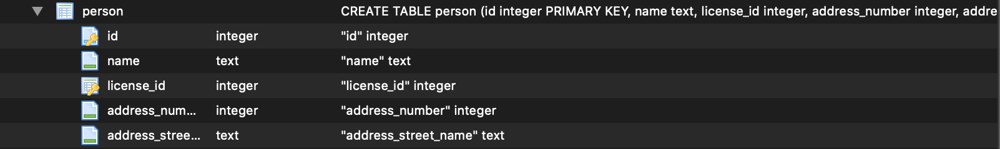
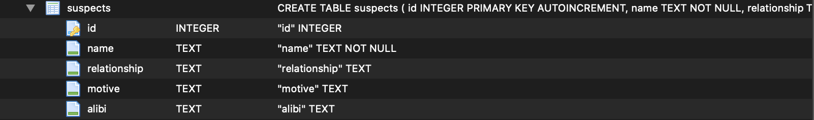
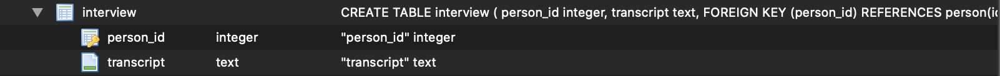
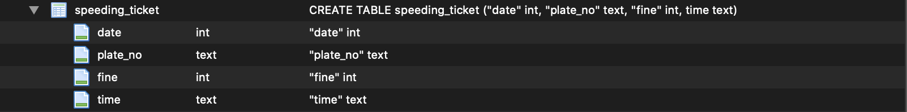
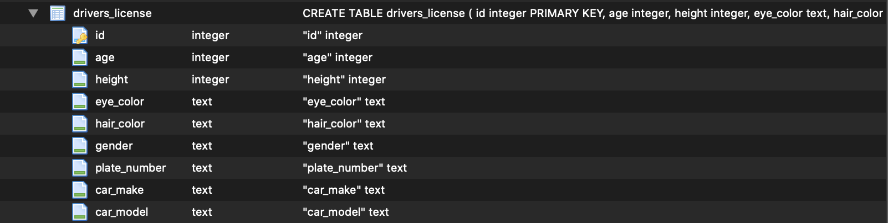
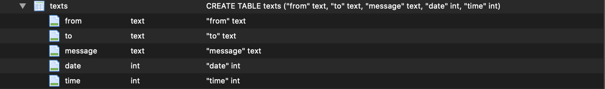

# SQL Murder Mystery

There's been a murder in SQLCity! Can you find out who did it using your SQL skills? This exercise is completely beginner-friendly and a great way to learn the basics of SQL!

## How to Play
1. Open the [SQL Murder Mystery website](https://sanasv.github.io/sql-mysteries-ieee/).
2. Use the SQL editor to write and execute queries.
3. Examine the evidence in the database tables to piece together clues and solve the case. (Take notes if you need!)

## The Database

Navigate your way through the following tables to find evidence and clues:

## Acknowledgments
- Thanks to Knight Lab for the original SQL Murder Mystery.
- Inspired by crime-solving games and SQL learning tools.

## Copyright and License
Original code for this project is released under [the MIT License](https://github.com/NUKnightLab/sql-mysteries/blob/master/LICENSE). 

Original text and other content is released under [Creative Commons CC BY-SA 4.0](https://creativecommons.org/licenses/by-sa/4.0/). 

SQL query custom web components used here were adapted from code created and released to the public domain by Zi Chong Kao, creator of [Select Star SQL](https://selectstarsql.com/).

[Detective image by rambleron](https://www.vecteezy.com/vector-art/174092-clue-illustration) used under Vecteezy's free license.
